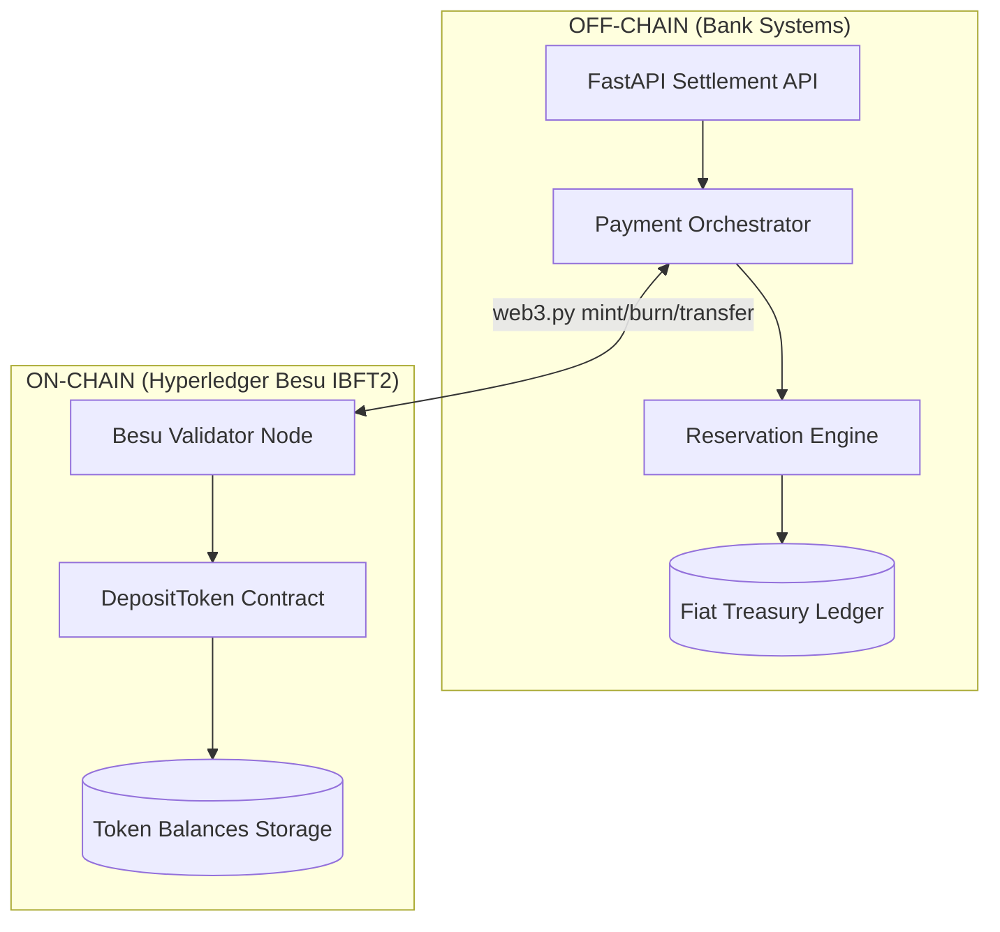
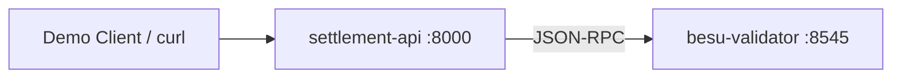
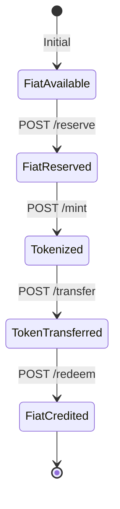
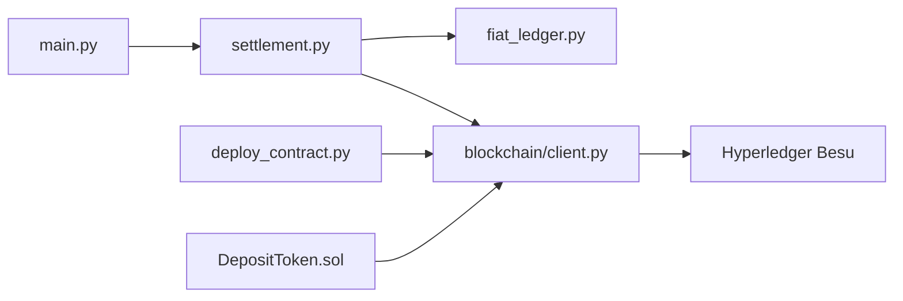

# Architecture — Tokenized Deposit Settlement POC

## 1. Executive view

Institutional tokenized settlement separates **where value is stored** from **where ownership claims are exchanged**:

| Layer | What it holds | Why |
|-------|----------------|-----|
| **Off-chain** | Real fiat in bank treasury | Legal finality, regulation, RTGS integration |
| **On-chain** | Token balances (deposit claims) | Atomic transfer, shared audit trail, programmability |

## 2. Component catalog

### Off-chain (belongs off-chain because…)

| Component | File | Institutional parallel |
|-----------|------|------------------------|
| **Fiat treasury ledger** | `backend/app/fiat_ledger.py` | Core banking GL — legal money |
| **Reservation engine** | `reserve()` in fiat ledger | Kinexys "earmark" / hold before tokenization |
| **Payment orchestration** | `backend/app/settlement.py` | Bank middleware coordinating GL + DLT |
| **API layer** | `backend/main.py` | Client connectivity (FIX/API gateway in prod) |

**Why off-chain:** Fiat is regulated deposit money. Only licensed banks hold it. Blockchain records **claims**, not physical dollars in the Fed.

### On-chain (belongs on-chain because…)

| Component | File | Institutional parallel |
|-----------|------|------------------------|
| **Deposit token contract** | `contracts/DepositToken.sol` | JPM deposit token / Citi Token / Partior ledger asset |
| **Token ownership** | `_balances` mapping | Who holds the claim on pooled fiat |
| **Mint / burn** | `mint()`, `burn()` | Bank-only supply adjustment |
| **Transfer** | `transfer()` | Atomic PvP-style leg on shared ledger |

**Why on-chain:** Multi-party visibility, immutable ordering, smart contract hooks (DvP, escrow) without each bank trusting the other's database.

## 3. Network topology (development)

- **1 IBFT2 validator** — `0xf39Fd6e51aad88F6F4ce6aB8827279cffFb92266`
- **Chain ID** 1337
- **Block time** 2 seconds

See [docs/BESU_SCALING.md](./docs/BESU_SCALING.md) for 3-validator production-style topology.

## 4. Institutional wallet mapping

| Entity | Off-chain client ID | On-chain address (dev) |
|--------|---------------------|-------------------------|
| Bank operator | — | `0xf39F…2266` (mints/burns) |
| Alice Corporation | `ALICE` | `0x7099…C8d` |
| Bob Corporation | `BOB` | `0x3C44…B177` |

Each corporation has a **nostro-style** on-chain wallet controlled by HSM in production; this POC uses well-known test keys.

## 5. Settlement lifecycle

## 6. Kinexys / Citi / Partior mapping

| Step | Kinexys (JPM) | Citi Token Services | Partior |
|------|---------------|---------------------|---------|
| Reserve | Fiat earmarked in JPM treasury | Citi debits available, holds for tokenization | Member bank reserves against nostro |
| Mint | JPM deposit tokens issued on permissioned network | Citi mints bank deposit tokens | Ledger credits token to payer wallet |
| Transfer | Atomic on-ledger move | Token ownership transfer | Shared ledger updates both members |
| Redeem/Burn | Tokens burned, fiat released | Detokenize to beneficiary account | Net settlement + token burn |

## 7. Observability model

Every mutating API response includes:

1. **Fiat ledger** — available + reserved per client  
2. **Token ledger** — on-chain `balanceOf` per client  
3. **Transaction hash** — audit trail anchor  
4. **Block number** — ordering proof  
5. **Event logs** — decoded `Mint`, `Transfer`, `Burn`  

This mirrors institutional **dual-ledger reconciliation**: operations teams match GL entries to chain events.

## 8. File interaction map

