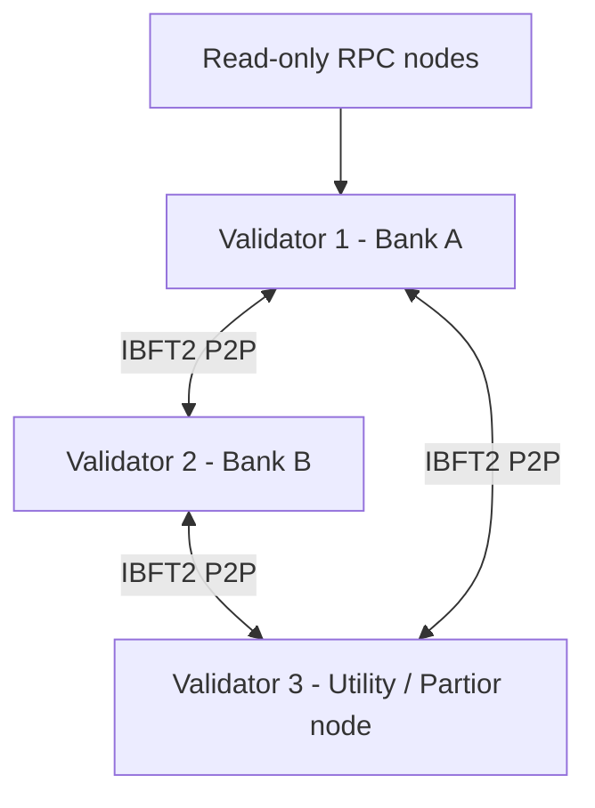

# Extending Besu — From 1 to 3 Validators

## Current (POC)

- **Consensus:** IBFT 2.0  
- **Validators:** 1 (`0xf39Fd6e51aad88F6F4ce6aB8827279cffFb92266`)  
- **Purpose:** Local learning, fast iteration  

## Target (institutional dev/UAT)



### Steps to add validators

1. **Generate validator keys** (one per institution):

   ```bash
   besu operator generate-blockchain-config \
     --config-file=ibftConfigFile.json \
     --to=networkFiles \
     --private-key-file-name=key
   ```

2. **Update genesis `extraData`** with all 3 validator addresses (RLP-encoded IBFT extra data).

3. **Deploy 3 Besu containers**, each with:
   - Unique `node-private-key-file`
   - Shared genesis volume
   - `static-nodes.json` listing enodes of all validators

4. **Configure permissions** (production):
   - `permissions.toml` — account allowlist
   - `config.toml` — transaction allowlist plugin

### docker-compose sketch (3 validators)

```yaml
services:
  validator1:
    image: hyperledger/besu:24.12.2
    volumes:
      - ./besu/genesis/genesis-3val.json:/genesis/genesis.json:ro
      - ./besu/validators/val1/key:/key:ro
    command:
      - --genesis-file=/genesis/genesis.json
      - --node-private-key-file=/key
      - --rpc-http-enabled=false  # validators often have no public RPC

  validator2:
    # same genesis, val2 key, static-nodes to val1+val3

  validator3:
    # same genesis, val3 key

  rpc-node:
  # non-validator for settlement-api JSON-RPC
```

### Distributed consensus behavior

- IBFT2 requires **⌊2n/3⌋ + 1** honest validators (2 of 3 for BFT).  
- Block period (2s in POC) trades latency vs throughput.  
- Institutional networks add **privacy** (Besu Orion/Tessera — deprecated path) or **layer-2** channels; this POC uses **public state within permissioned network**.

### Deployment checklist (production)

| Item | POC | Production |
|------|-----|------------|
| Keys | Committed dev keys | HSM / Vault |
| RPC | Open CORS | mTLS, IP allowlist |
| Genesis | Local file | Ceremony, multi-sig |
| Monitoring | API logs | Prometheus + audit log store |
| Reconciliation | Manual via `/balances` | Batch job matching GL ↔ chain |

### Kinexys / Citi / Partior infrastructure parallels

- **Kinexys:** JPM-operated permissioned network with institutional onboarding and API gateway.  
- **Citi Token Services:** Bank-centric mint authority; clients connect via bank APIs, not directly to validators.  
- **Partior:** Multi-bank validators; shared ledger with member-specific off-chain settlement rails.
