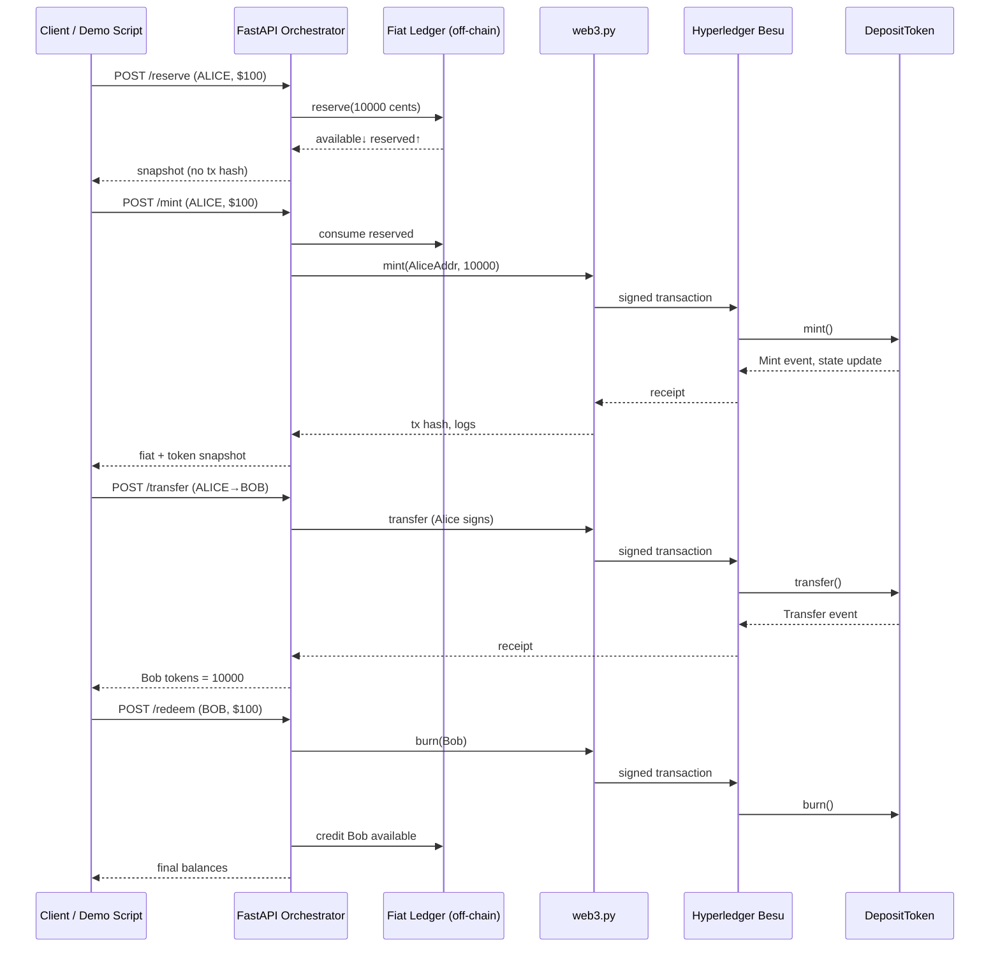
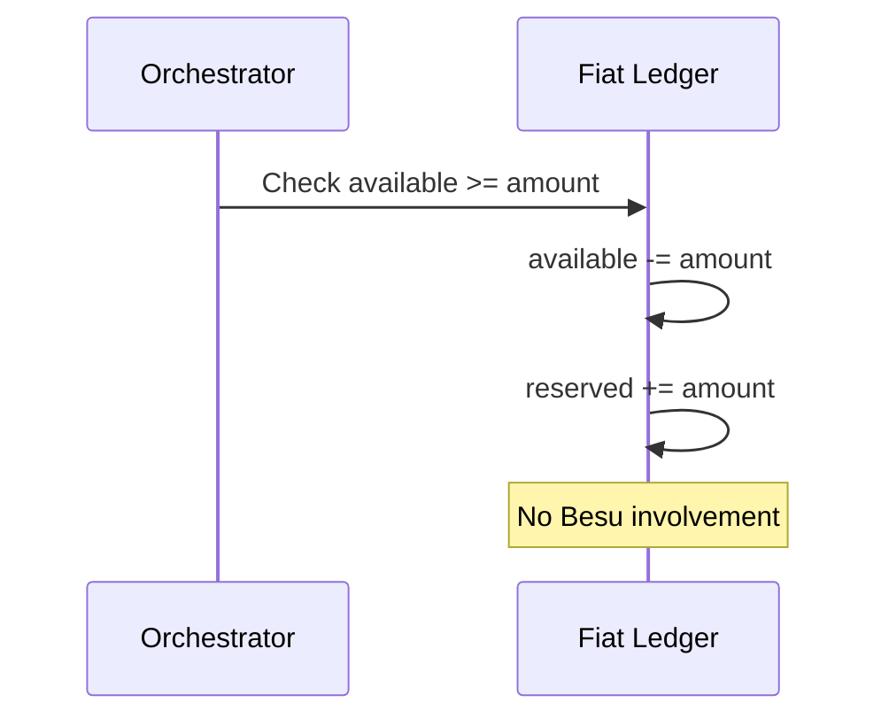
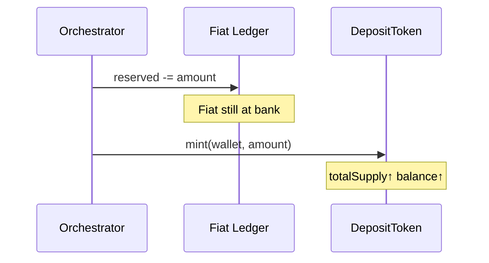
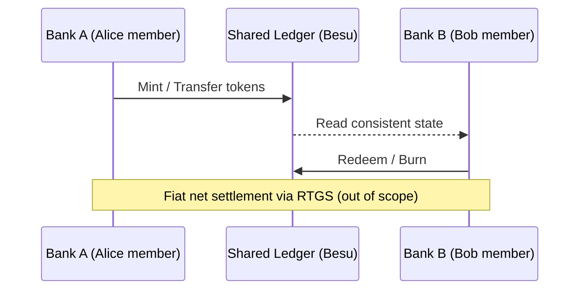

# Sequence Diagrams

## Full settlement lifecycle

```mermaid
sequenceDiagram
    participant C as Client / Demo Script
    participant API as FastAPI Orchestrator
    participant FL as Fiat Ledger (off-chain)
    participant W3 as web3.py
    participant B as Hyperledger Besu
    participant SC as DepositToken

    C->>API: POST /reserve (ALICE, $100)
    API->>FL: reserve(10000 cents)
    FL-->>API: available↓ reserved↑
    API-->>C: snapshot (no tx hash)

    C->>API: POST /mint (ALICE, $100)
    API->>FL: consume reserved
    API->>W3: mint(AliceAddr, 10000)
    W3->>B: signed transaction
    B->>SC: mint()
    SC-->>B: Mint event, state update
    B-->>W3: receipt
    W3-->>API: tx hash, logs
    API-->>C: fiat + token snapshot

    C->>API: POST /transfer (ALICE→BOB)
    API->>W3: transfer (Alice signs)
    W3->>B: signed transaction
    B->>SC: transfer()
    SC-->>B: Transfer event
    B-->>API: receipt
    API-->>C: Bob tokens = 10000

    C->>API: POST /redeem (BOB, $100)
    API->>W3: burn(Bob)
    W3->>B: signed transaction
    B->>SC: burn()
    API->>FL: credit Bob available
    API-->>C: final balances
```

## Reserve-only (off-chain)

```mermaid
sequenceDiagram
    participant API as Orchestrator
    participant FL as Fiat Ledger

    API->>FL: Check available >= amount
    FL->>FL: available -= amount
    FL->>FL: reserved += amount
    Note over FL: No Besu involvement
```

## Mint (dual-ledger)

```mermaid
sequenceDiagram
    participant API as Orchestrator
    participant FL as Fiat Ledger
    participant SC as DepositToken

    API->>FL: reserved -= amount
    Note over FL: Fiat still at bank
    API->>SC: mint(wallet, amount)
    Note over SC: totalSupply↑ balance↑
```

## Institutional three-party view (Partior-style)

```mermaid
sequenceDiagram
    participant BA as Bank A (Alice member)
    participant L as Shared Ledger (Besu)
    participant BB as Bank B (Bob member)

    BA->>L: Mint / Transfer tokens
    L-->>BB: Read consistent state
    BB->>L: Redeem / Burn
    Note over BA,BB: Fiat net settlement via RTGS (out of scope)
```
