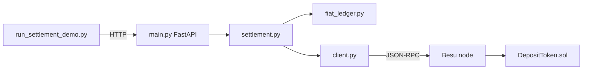
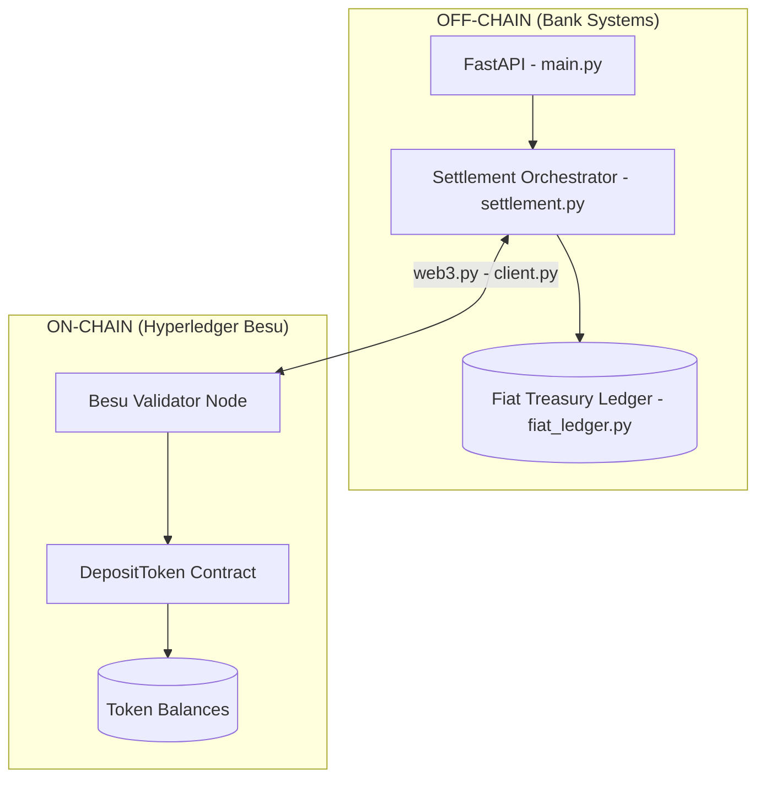
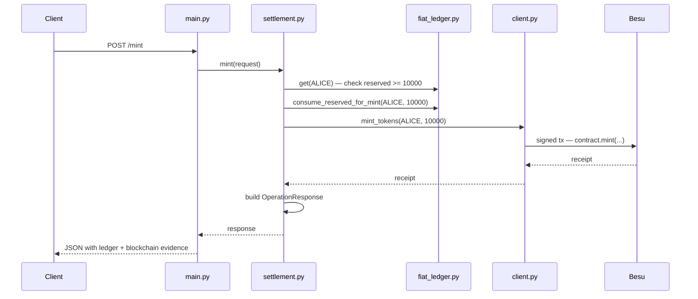

# Tokenized Deposit POC — Full Codebase Explanation

This document explains the entire **tokenized-deposit-poc** project for junior software engineers: what it does, how the pieces fit together, and what every important file is responsible for.

---

## Table of contents

1. [What is this project?](#1-what-is-this-project)
2. [The big picture](#2-the-big-picture)
3. [The business story (Alice → Bob)](#3-the-business-story-alice--bob)
4. [How components connect](#4-how-components-connect)
5. [Root-level files](#5-root-level-files)
6. [Smart contract (`contracts/`)](#6-smart-contract-contracts)
7. [Backend (`backend/`)](#7-backend-backend)
8. [Scripts (`scripts/`)](#8-scripts-scripts)
9. [Blockchain infrastructure (`besu/`)](#9-blockchain-infrastructure-besu)
10. [Runtime and deploy artifacts](#10-runtime-and-deploy-artifacts)
11. [Documentation (`docs/`)](#11-documentation-docs)
12. [Request flow example (mint)](#12-request-flow-example-mint)
13. [Mental model for juniors](#13-mental-model-for-juniors)
14. [Quick file checklist](#14-quick-file-checklist)

---

## 1. What is this project?

The workspace contains one main project: **`tokenized-deposit-poc`**.

It is a **proof of concept (POC)** for how a bank might settle a cross-border payment using **tokenized deposits** on a **private blockchain** ([Hyperledger Besu](https://besu.hyperledger.org/)), not public cryptocurrency.

Think of it as **two ledgers** that must stay in sync:

| Ledger | Where it lives | What it represents |
|--------|----------------|-------------------|
| **Fiat ledger** | Python in memory (`fiat_ledger.py`) | Real dollars at the bank (available vs reserved) |
| **Token ledger** | Smart contract on Besu (`DepositToken.sol`) | Claims on that fiat — who owns how much of the pooled deposit |

A payment follows four steps:

**reserve fiat → mint tokens → transfer tokens → redeem (burn) tokens back to fiat**

> **Important:** This is not DeFi or a retail wallet. Tokenized deposits are **claims on fiat held off-chain** at the issuing bank.

---

## 2. The big picture



### What happens when you start the stack

When you run `.\run.ps1` (Windows) or `./run.sh` (macOS/Linux), or `docker compose up`:

1. **Besu** starts a private chain (IBFT2 consensus, ~2-second blocks).
2. **Settlement API** waits for Besu, deploys the smart contract, then serves HTTP on port **8000**.
3. The **demo script** (`run_settlement_demo.py`) calls the API in order: reserve → mint → transfer → redeem.

### Ports and services

| Service | Port | Purpose |
|---------|------|---------|
| Settlement API | 8000 | REST API + OpenAPI docs at `/docs` |
| Besu JSON-RPC | 8545 | Blockchain reads and transactions |
| Besu WebSocket | 8546 | Optional streaming RPC |

---

## 3. The business story (Alice → Bob)

### Initial state

| Client | Fiat (available) | Tokens |
|--------|------------------|--------|
| Alice Corporation | $1,000.00 | 0 |
| Bob Corporation | $0.00 | 0 |

Alice sends **$100** to Bob using: **reserve → mint → transfer → redeem**.

### Step-by-step

| Step | API endpoint | Off-chain fiat | On-chain tokens |
|------|--------------|----------------|-----------------|
| Start | — | Alice: $1,000 available | Alice & Bob: 0 tokens |
| 1 Reserve | `POST /reserve` | Alice: $900 available, $100 **reserved** | No change |
| 2 Mint | `POST /mint` | Reserved $100 consumed (still at bank, now “tokenized”) | Alice gets 10,000 units (= $100.00) |
| 3 Transfer | `POST /transfer` | Fiat unchanged | Alice → Bob on chain |
| 4 Redeem | `POST /redeem` | Bob gets $100 **available** fiat | Bob’s tokens burned |

### Amounts are always in cents

All amounts use **integers in cents** (e.g. `10000` = $100.00) to avoid floating-point rounding bugs with money.

The smart contract uses **2 decimals** (`decimals = 2`), so 1 on-chain token unit = 1 cent.

---

## 4. How components connect



### Separation of concerns

| Layer | Files | Responsibility |
|-------|-------|----------------|
| HTTP API | `main.py` | Expose REST endpoints, handle errors |
| Orchestration | `settlement.py` | Enforce business order (reserve before mint, etc.) |
| Fiat | `fiat_ledger.py` | Simulate core banking / treasury |
| Blockchain | `blockchain/client.py` | Talk to Besu, sign transactions |
| On-chain logic | `DepositToken.sol` | Token balances, mint, burn, transfer |

---

## 5. Root-level files

### `README.md`

- Project introduction and business scenario
- Folder structure overview
- API endpoint table
- Links to other documentation
- Sample terminal output from the demo

**Why it exists:** Entry point for anyone new to the repo.

---

### `ARCHITECTURE.md`

- System design: off-chain vs on-chain split
- Component catalog with institutional parallels (Kinexys, Citi, Partior)
- Network topology and wallet mapping
- Settlement lifecycle state diagram
- File interaction map

**Why it exists:** Explains *why* things are split across layers, not just *what* files exist.

---

### `RUN.md`

- Prerequisites (Docker, Python)
- Start/stop/reset commands
- How to run the end-to-end demo
- How to view logs

**Why it exists:** Operational guide — how to run the POC locally.

---

### `docker-compose.yml`

Orchestrates two Docker services:

#### Service: `besu`

- Image: `hyperledger/besu:24.12.2`
- Ports: 8545 (HTTP RPC), 8546 (WebSocket), 30303 (P2P)
- Mounts genesis and config; persists chain data in volume `besu-data`
- Uses IBFT2 genesis and validator private key

#### Service: `settlement-api`

- Built from `backend/Dockerfile`
- Connects to Besu at `http://besu:8545`
- Exposes port 8000
- Injects dev-only private keys and client addresses via environment variables

**Why it exists:** One command brings up the full stack for demos and integration testing.

---

### `run.ps1` / `run.sh`

Thin wrappers that:

1. Run `docker compose up --build -d`
2. Poll `http://localhost:8000/health` until the API is ready
3. Print next steps (run demo script)

The PowerShell script (`run.ps1`) also prints Besu/API logs if startup fails.

**Why they exist:** Avoid memorizing compose flags and wait loops.

---

### `.gitignore`

Ignores:

- Python cache (`__pycache__/`, `*.pyc`)
- Virtual environments (`.venv/`, `venv/`)
- `.env` (secrets)
- `deployed/contract_address.txt` (environment-specific deploy address)
- Besu data volume artifacts

**Why it exists:** Keep generated and local-only files out of version control.

---

## 6. Smart contract (`contracts/`)

### `contracts/DepositToken.sol`

The **on-chain** representation of bank deposit tokens (similar in concept to JPM Kinexys or Citi Token Services deposit tokens — not Bitcoin or retail crypto).

#### Key concepts

| Concept | Purpose |
|---------|---------|
| `name` / `symbol` / `decimals` | Token metadata; `decimals = 2` means 1 unit = 1 cent |
| `bankOperator` | Only this address can `mint` and `burn` (bank controls supply) |
| `_balances` | Mapping of address → token balance (the on-chain ledger) |
| `totalSupply` | Total tokens in circulation (must match tokenized fiat) |

#### Main functions

| Function | Who can call | What it does |
|----------|--------------|--------------|
| `mint(to, amount)` | Bank operator only | Creates tokens when fiat is tokenized |
| `burn(from, amount)` | Bank operator only | Destroys tokens when fiat is released |
| `transfer(to, amount)` | Token holder | Moves tokens between institutional wallets |
| `approve` / `transferFrom` | Standard ERC-20-style | Delegated spending (included for completeness) |
| `balanceOf(account)` | Anyone (view) | Read balance for reconciliation |

#### Events

- `Mint`, `Burn`, `Transfer` — used by the API to show audit evidence in responses

**Why a smart contract:** Provides immutable ordering, atomic transfers, and a shared audit trail on a permissioned network.

---

### `contracts/build/DepositToken.json`

- **Generated** by `scripts/compile_contract.py`
- Contains **ABI** (interface) and **bytecode** (deployable binary)
- Read by `BesuClient.deploy_contract()` at runtime

**Do not edit by hand.** Re-run `python scripts/compile_contract.py` after changing the `.sol` file.

---

## 7. Backend (`backend/`)

The Python **FastAPI** application acts as **bank middleware** between simulated core banking and the blockchain.

### `backend/main.py`

HTTP entry point for the settlement API.

#### Startup (`lifespan`)

1. Verify connection to Besu (fail fast if unreachable)
2. Load or deploy `DepositToken` contract
3. Create `SettlementOrchestrator`

#### Endpoints

| Method | Path | Layer | Description |
|--------|------|-------|-------------|
| `GET` | `/health` | Infra | Besu connection, chain ID, block, contract address |
| `POST` | `/reserve` | Off-chain | Lock fiat: available → reserved |
| `POST` | `/mint` | On-chain | Mint tokens after fiat reserved |
| `POST` | `/transfer` | On-chain | Transfer tokens between clients |
| `POST` | `/redeem` | Both | Burn tokens + credit fiat |
| `GET` | `/balances` | Both | Snapshot of fiat and token ledgers |

**Why it exists:** External clients (demo script, curl, future UI) only speak HTTP — they do not call web3 directly.

---

### `backend/app/config.py`

Runtime configuration using **pydantic-settings**:

| Setting | Default (dev) | Purpose |
|---------|---------------|---------|
| `besu_rpc_url` | `http://localhost:8545` | Besu JSON-RPC endpoint |
| `chain_id` | `1337` | Must match genesis |
| `bank_private_key` | Dev key | Signs mint/burn transactions |
| `alice_onchain_address` | Fixed test address | Alice’s wallet on chain |
| `bob_onchain_address` | Fixed test address | Bob’s wallet on chain |
| `contract_address_file` | `deployed/contract_address.txt` | Persisted deploy address |
| `contracts_dir` | `contracts` | Path to Solidity artifacts |

Reads `.env` if present. **Dev keys must never be used in production.**

---

### `backend/app/models.py`

**Pydantic** schemas for request validation and response shape.

#### Request models

- `ReserveRequest` — `client_id`, `amount` (cents, must be &gt; 0)
- `MintRequest` — `client_id`, `amount`
- `TransferRequest` — `from_client_id`, `to_client_id`, `amount`
- `RedeemRequest` — `client_id`, `amount`

#### Response models

- `FiatAccountState` — available + reserved per client
- `TokenAccountState` — on-chain address + balance per client
- `BlockchainEvidence` — tx hash, block number, gas, decoded event logs
- `LedgerSnapshot` — both ledgers together
- `OperationResponse` — full API response wrapper

**Why it exists:** FastAPI auto-validates JSON bodies and generates OpenAPI documentation at `/docs`.

---

### `backend/app/fiat_ledger.py`

**In-memory** simulation of core banking / treasury.

#### Initial accounts

- **ALICE:** `100_000` cents available ($1,000.00), `0` reserved
- **BOB:** `0` available, `0` reserved

#### Two buckets per client

| Bucket | Meaning |
|--------|---------|
| `available` | Spendable fiat balance |
| `reserved` | Fiat earmarked for tokenization (not yet minted) |

#### Operations

| Method | Effect |
|--------|--------|
| `reserve(client_id, amount)` | `available -= amount`, `reserved += amount` |
| `consume_reserved_for_mint(client_id, amount)` | `reserved -= amount` (after successful mint) |
| `credit_available(client_id, amount)` | `available += amount` (after redeem) |
| `snapshot()` | Current state for API responses |

Also maintains `_history` for internal audit (not exposed via API in this POC).

**Why it exists:** Real banks do not put USD on a public chain. This simulates the GL/treasury side that must stay aligned with on-chain token supply.

---

### `backend/app/settlement.py`

The **orchestrator** — coordinates fiat ledger and blockchain in the correct order.

#### `SettlementOrchestrator` methods

| Method | Order of operations | Blockchain tx? |
|--------|---------------------|----------------|
| `reserve()` | Update fiat only | No |
| `mint()` | Check reserved ≥ amount → consume reserved → `chain.mint_tokens()` | Yes |
| `transfer()` | `chain.transfer_tokens()` only | Yes |
| `redeem()` | `chain.burn_tokens()` → `fiat.credit_available()` | Yes |
| `balances()` | Read both ledgers | No |

Every mutating response includes:

1. Updated **fiat** and **token** ledger snapshots
2. **Blockchain evidence** (hash, block, gas, logs) when applicable
3. **Institutional notes** (educational mapping to Kinexys / Citi / Partior)

**Why it exists:** Production systems centralize workflow rules here so they are not duplicated in every API handler.

---

### `backend/app/blockchain/client.py`

**web3.py** adapter to Hyperledger Besu.

#### Responsibilities

| Area | Details |
|------|---------|
| Connection | `HTTPProvider`, `ExtraDataToPOAMiddleware` for IBFT/PoA chains |
| Contract lifecycle | `load_or_deploy_contract()` — read saved address or deploy fresh |
| Bank transactions | `mint_tokens`, `burn_tokens` — signed by bank account |
| Client transactions | `transfer_tokens` — signed by sender’s private key |
| Reads | `token_balance`, `totalSupply`, `balanceOf` |
| Evidence | `receipt_to_evidence()` — decode Mint/Transfer/Burn logs |

#### Transaction signing

- **Mint / burn:** Bank private key (`bankOperator` on contract)
- **Transfer:** Sender’s key (Alice’s dev key by default via env `ALICE_PRIVATE_KEY`)

**Why it exists:** Keeps all JSON-RPC, gas, signing, and ABI details out of business logic.

---

### `backend/Dockerfile`

Builds the API container:

1. Install Python dependencies from `requirements.txt`
2. Copy `backend/`, `contracts/`, `scripts/`
3. Set `PYTHONPATH=/app`

**Startup command:**

```text
wait_for_besu.py → deploy_contract.py → uvicorn backend.main:app
```

Ensures the chain is ready and the contract is deployed before accepting HTTP traffic.

---

### `backend/requirements.txt`

Pinned Python dependencies:

- `fastapi`, `uvicorn` — HTTP server
- `web3`, `eth-account` — Blockchain interaction
- `pydantic`, `pydantic-settings` — Config and schemas
- `py-solc-x` — Optional Solidity compile support
- `httpx` — HTTP client (also used in scripts)

---

### Package init files

| File | Purpose |
|------|---------|
| `backend/__init__.py` | Marks `backend` as a Python package |
| `backend/app/__init__.py` | Marks `app` as a subpackage |
| `backend/app/blockchain/__init__.py` | Marks `blockchain` as a subpackage |

These are mostly empty; they enable imports like `from backend.app.settlement import ...`.

---

## 8. Scripts (`scripts/`)

### `scripts/compile_contract.py`

- Uses **py-solc-x** to compile `DepositToken.sol` with Solidity **0.8.24**
- Writes `contracts/build/DepositToken.json` (ABI + bytecode)

**When to run:** After any change to `DepositToken.sol`.

---

### `scripts/deploy_contract.py`

- Connects via `BesuClient`
- Calls `load_or_deploy_contract()` and prints the contract address

**When it runs:** Automatically at API container startup (before uvicorn).

---

### `scripts/wait_for_besu.py`

- Polls Besu JSON-RPC for up to **180 seconds**
- Exits successfully when `web3.is_connected()` and prints block number

**Why it exists:** The API must not deploy or serve traffic against a node that is not ready.

---

### `scripts/run_settlement_demo.py`

End-to-end demonstration:

1. Wait for `GET /health` → `status: ok`
2. `POST /reserve` — Alice, $100
3. `POST /mint` — Alice, $100
4. `POST /transfer` — Alice → Bob, $100
5. `POST /redeem` — Bob, $100
6. `GET /balances` — final state

Uses **httpx** against `http://localhost:8000`. Requires API running in Docker; install `httpx` on the host (`pip install -r scripts/requirements-demo.txt`).

---

### `scripts/requirements-demo.txt`

Minimal host dependency: `httpx` for the demo script only.

---

## 9. Blockchain infrastructure (`besu/`)

### `besu/genesis/genesis-ibft.json`

The **genesis block** — the chain’s birth certificate.

| Field | Value / role |
|-------|----------------|
| `chainId` | `1337` |
| `ibft2.blockperiodseconds` | `2` — new block every ~2 seconds |
| `alloc` | Prefunded balances for bank, Alice, Bob, validator (gas money) |
| `extraData` | Encodes the **single IBFT validator** identity |

**Why it exists:** Without genesis, Besu does not know consensus rules, chain ID, or initial account balances.

---

### `besu/config/config.toml`

Node runtime settings:

- Data path, genesis file reference
- P2P host/port, max peers
- Full sync mode
- Mining enabled, miner coinbase address
- Log level

**Why it exists:** Separates node tuning from Docker command-line flags in `docker-compose.yml`.

---

### `besu/config/keys/validator.key`

Private key for the IBFT validator that **signs new blocks**.

Must match the validator address encoded in genesis `extraData`.

> **Security warning:** Development key only. Never commit or reuse production validator keys.

---

### `besu/generated/` (optional artifacts)

May contain output from Besu network generation tools (`ibftConfigFile.json`, alternate genesis copies, extra keys).

The **running Docker stack** uses:

- `besu/genesis/genesis-ibft.json`
- `besu/config/keys/validator.key`

Treat `besu/generated/` as reference or leftover tooling output unless you regenerate the network.

---

## 10. Runtime and deploy artifacts

### `deployed/contract_address.txt`

- Written after first successful contract deployment
- Example: `0xAE519FC2Ba8e6fFE6473195c092bF1BAe986ff90`
- Listed in `.gitignore` — each environment keeps its own address
- API reads this on restart to **avoid redeploying** and losing on-chain state

**Why it exists:** Redeploying on every restart would reset token balances and break demos.

---

## 11. Documentation (`docs/`)

| File | Purpose |
|------|---------|
| `explaination.md` | This document — full codebase walkthrough |
| `WALKTHROUGH.md` | Step-by-step lifecycle with state tables |
| `SEQUENCE_DIAGRAMS.md` | Mermaid sequence diagrams per operation |
| `API_EXAMPLES.md` | curl examples for manual testing |
| `SMART_CONTRACT.md` | Deep dive on `DepositToken.sol` |
| `BESU_SCALING.md` | Growing from 1 to 3 validators |
| `FILE_GUIDE.md` | Short “why this file exists” reference table |

---

## 12. Request flow example (mint)

Tracing `POST /mint` with `{"client_id": "ALICE", "amount": 10000}`:



If `/reserve` was skipped, `mint` fails with a clear error — the business rule is enforced in the **orchestrator**, not only on chain.

---

## 13. Mental model for juniors

### 1. Separation of concerns

```
HTTP (main.py)
  → workflow (settlement.py)
    → fiat (fiat_ledger.py)
    → chain (blockchain/client.py)
      → contract (DepositToken.sol)
```

### 2. Two sources of truth

Operations teams in production **reconcile**:

- Off-chain: available + reserved fiat per client
- On-chain: `balanceOf` per address and `totalSupply`

They must stay consistent across the lifecycle.

### 3. Not every step hits the blockchain

**Reserve** is intentionally off-chain — like earmarking funds in treasury before tokenization.

### 4. Two types of keys

| Operation | Signer | Reason |
|-----------|--------|--------|
| Mint, burn | Bank | Contract `onlyBankOperator` modifier |
| Transfer | Sender (e.g. Alice) | Standard token `transfer` from holder’s wallet |

### 5. POC shortcuts (not production)

- In-memory fiat (no database)
- Hardcoded clients: `ALICE`, `BOB` only
- Well-known dev private keys in repo and compose file
- Single Besu validator

---

## 14. Quick file checklist

| Path | Role |
|------|------|
| `contracts/DepositToken.sol` | On-chain token logic |
| `contracts/build/DepositToken.json` | Compiled ABI + bytecode (generated) |
| `backend/main.py` | REST API surface |
| `backend/app/config.py` | Environment settings |
| `backend/app/models.py` | API request/response schemas |
| `backend/app/fiat_ledger.py` | Off-chain fiat simulation |
| `backend/app/settlement.py` | Workflow coordinator |
| `backend/app/blockchain/client.py` | Besu / web3 integration |
| `backend/Dockerfile` | API container image + startup |
| `backend/requirements.txt` | Python dependencies |
| `scripts/compile_contract.py` | Build contract artifact |
| `scripts/wait_for_besu.py` | Startup: wait for chain |
| `scripts/deploy_contract.py` | Startup: deploy contract |
| `scripts/run_settlement_demo.py` | End-to-end demo |
| `docker-compose.yml` | Besu + API stack |
| `run.ps1` / `run.sh` | One-click local start |
| `besu/genesis/genesis-ibft.json` | Chain genesis |
| `besu/config/config.toml` | Besu node configuration |
| `besu/config/keys/validator.key` | IBFT block signer (dev) |
| `deployed/contract_address.txt` | Persisted contract address (generated) |
| `README.md` | Project entry point |
| `ARCHITECTURE.md` | System design |
| `RUN.md` | How to run locally |

---

## Related reading

- [README.md](../README.md) — Quick start and API summary
- [ARCHITECTURE.md](../ARCHITECTURE.md) — Design diagrams and institutional mapping
- [RUN.md](../RUN.md) — Start, stop, reset commands
- [WALKTHROUGH.md](./WALKTHROUGH.md) — Detailed lifecycle and state tables

---

*Last updated for the tokenized-deposit-poc codebase structure as of the institutional settlement POC layout.*
